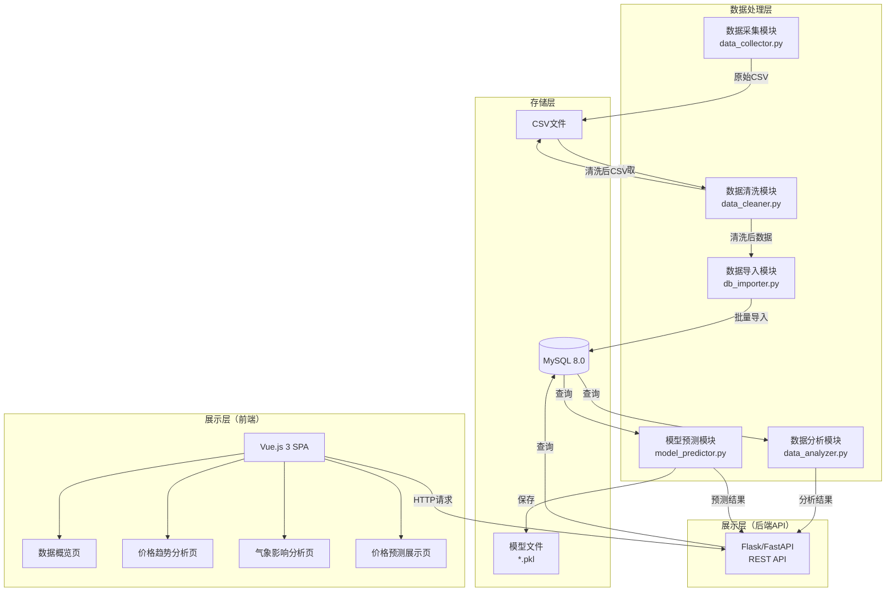
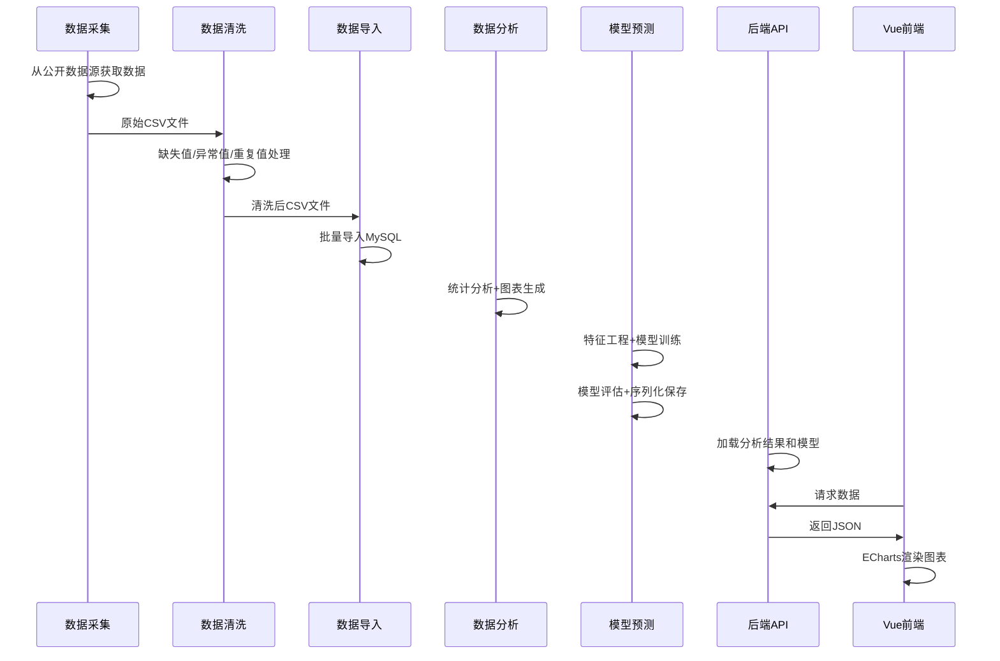
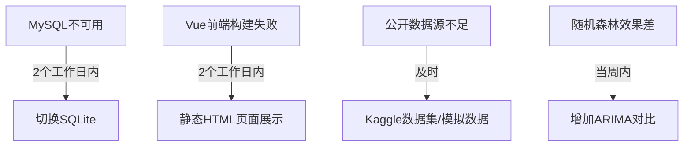

# 设计文档：农产品价格采集监控平台

## 概述

本设计文档描述"农产品价格采集监控平台"的技术设计方案。系统实现从农产品价格数据采集、清洗、存储、统计分析、机器学习预测到 Web 可视化展示的完整数据处理流水线，并保留 Kafka、HDFS、Spark、Redis 等完整实训平台扩展设计。

### 设计目标

1. 实现农产品价格数据和辅助气象数据的自动化采集与清洗
2. 提供 MySQL 数据存储，支持价格监控和高效查询
3. 实现多维度统计分析和可视化图表生成
4. 构建随机森林/ARIMA价格预测模型
5. 提供 Vue.js 前端 + Flask/FastAPI 后端的农产品价格监控展示系统

### 技术栈选择

- **语言**：Python 3.10+（后端、数据处理）、JavaScript/TypeScript（前端）
- **前端框架**：Vue.js 3 + Vite（单页应用）
- **后端框架**：Flask/FastAPI（REST API）
- **数据存储**：MySQL 8.0（主存储）、SQLite（降级方案），HDFS/Kafka/Redis 作为完整平台扩展
- **前端图表库**：ECharts / Chart.js（交互式图表）
- **版本管理**：Git
- **数据处理**：pandas、numpy
- **机器学习**：scikit-learn（随机森林）、statsmodels（ARIMA）
- **测试框架**：pytest + Hypothesis（属性测试）

## 架构

### 系统架构图



### 数据流



### 分层设计

系统采用三层架构：

1. **数据处理层**：五个模块按流水线顺序执行数据采集→清洗→存储→分析→预测
2. **展示层-后端**：Flask/FastAPI提供REST API接口，查询MySQL返回分析和预测结果
3. **展示层-前端**：Vue.js 3单页应用，通过ECharts/Chart.js渲染交互式图表

## 组件与接口

### 数据采集模块（data_collector.py）

```python
class DataCollector:
    """农产品价格和气象数据采集模块"""

    def collect_price_data(self, products: List[str], regions: List[str],
                           months: int) -> pd.DataFrame:
        """从公开数据源采集农产品价格数据
        
        Args:
            products: 农产品列表（至少3种）
            regions: 地区列表（至少2个）
            months: 时间跨度（至少6个月）
        Returns:
            包含价格数据的DataFrame
        """

    def collect_weather_data(self, regions: List[str],
                             start_date: date, end_date: date) -> pd.DataFrame:
        """采集与价格数据对应地区和时间段的气象数据
        
        Returns:
            包含日期、平均气温、降雨量、湿度等字段的DataFrame
        """

    def load_kaggle_backup(self, dataset_name: str) -> pd.DataFrame:
        """加载Kaggle备选数据集（当公开数据源不足时）"""

    def validate_sufficiency(self, df: pd.DataFrame,
                              min_records: int = 1000,
                              min_products: int = 3,
                              min_regions: int = 2,
                              min_months: int = 6) -> bool:
        """验证数据集是否满足最低要求"""

    def validate_alignment(self, price_df: pd.DataFrame,
                            weather_df: pd.DataFrame) -> bool:
        """验证价格数据和气象数据在地区和时间段上是否对齐"""
```

### 数据清洗模块（data_cleaner.py）

```python
class DataCleaner:
    """数据清洗与标准化处理模块"""

    def clean(self, df: pd.DataFrame) -> Tuple[pd.DataFrame, CleaningReport]:
        """执行完整清洗流程，返回清洗后数据和清洗报告"""

    def handle_missing_values(self, df: pd.DataFrame) -> pd.DataFrame:
        """缺失值处理：<50%用均值/众数填充，>=50%删除字段"""

    def handle_outliers(self, df: pd.DataFrame,
                        numeric_columns: List[str]) -> pd.DataFrame:
        """异常值处理：对数值字段使用IQR方法修正为边界值"""

    def remove_duplicates(self, df: pd.DataFrame) -> pd.DataFrame:
        """重复值删除：基于全部字段完全相同的记录去重"""

    def standardize_format(self, df: pd.DataFrame) -> pd.DataFrame:
        """字段格式统一：日期YYYY-MM-DD，价格元/公斤"""

    def merge_data(self, price_df: pd.DataFrame,
                   weather_df: pd.DataFrame) -> pd.DataFrame:
        """按date和region字段关联合并价格和气象数据"""

    def validate_quality(self, df: pd.DataFrame,
                          max_missing_ratio: float = 0.2,
                          max_duplicate_ratio: float = 0.1) -> QualityResult:
        """验证清洗后数据质量是否达标"""
```

### 数据导入模块（db_importer.py）

```python
class DBImporter:
    """MySQL数据导入模块"""

    def __init__(self, connection_string: str):
        """初始化数据库连接"""

    def import_price_data(self, df: pd.DataFrame) -> int:
        """导入价格数据到price_data表，返回导入记录数"""

    def import_weather_data(self, df: pd.DataFrame) -> int:
        """导入气象数据到weather_data表，返回导入记录数"""

    def verify_import(self, table_name: str, expected_count: int) -> bool:
        """验证导入后记录数与预期一致"""

    def fallback_to_sqlite(self, sqlite_path: str) -> 'DBImporter':
        """MySQL不可用时降级为SQLite"""
```

### 数据分析模块（data_analyzer.py）

```python
class DataAnalyzer:
    """多维度统计分析模块"""

    def analyze_price_trend(self, df: pd.DataFrame) -> AnalysisResult:
        """价格趋势分析，生成折线图"""

    def analyze_monthly_price(self, df: pd.DataFrame) -> AnalysisResult:
        """月度价格分析，生成柱状图"""

    def analyze_regional_difference(self, df: pd.DataFrame) -> AnalysisResult:
        """地区差异分析，生成对比图"""

    def analyze_weather_correlation(self, df: pd.DataFrame) -> AnalysisResult:
        """气象影响分析，生成相关性热力图"""

    def analyze_price_volatility(self, df: pd.DataFrame) -> AnalysisResult:
        """价格波动分析，生成波动图"""

    def generate_report(self, results: List[AnalysisResult]) -> str:
        """生成统计分析报告（不少于500字）"""
```

### 模型预测模块（model_predictor.py）

```python
class ModelPredictor:
    """价格预测模型训练与评估模块"""

    def engineer_features(self, df: pd.DataFrame) -> pd.DataFrame:
        """特征工程：添加时间、季节、地区编码等特征"""

    def train_random_forest(self, X_train: pd.DataFrame,
                             y_train: pd.Series) -> RandomForestModel:
        """训练随机森林回归模型"""

    def train_arima(self, series: pd.Series) -> ARIMAModel:
        """训练ARIMA时间序列模型（备选）"""

    def evaluate_model(self, model, X_test: pd.DataFrame,
                       y_test: pd.Series) -> ModelMetrics:
        """评估模型，返回MAE、MSE、RMSE指标"""

    def should_trigger_arima(self, metrics: ModelMetrics,
                              test_mean_price: float) -> bool:
        """判断是否需要触发ARIMA补充（RMSE>均价30%或R²<0.5）"""

    def save_model(self, model, filepath: str) -> None:
        """序列化保存模型"""

    def load_model(self, filepath: str):
        """加载序列化模型"""
```

### 后端API（app.py）

```python
# Flask/FastAPI REST API

@app.route('/api/overview')
def get_overview():
    """返回数据集基本统计信息和数据量"""

@app.route('/api/price-trends')
def get_price_trends():
    """返回价格趋势数据，支持按农产品和地区筛选
    Query params: product, region
    """

@app.route('/api/weather-impact')
def get_weather_impact():
    """返回气象因素与价格的相关性矩阵数据"""

@app.route('/api/predictions')
def get_predictions():
    """返回预测结果对比数据和模型误差指标"""
```

### Vue前端页面结构

```
frontend/
├── src/
│   ├── views/
│   │   ├── OverviewPage.vue      # 数据概览页
│   │   ├── PriceTrendPage.vue    # 价格趋势分析页（支持筛选）
│   │   ├── WeatherImpactPage.vue # 气象影响分析页
│   │   └── PredictionPage.vue    # 价格预测展示页
│   ├── components/
│   │   ├── SideMenu.vue          # 左侧导航菜单
│   │   ├── HeaderBar.vue         # 顶部标题栏
│   │   ├── DataCard.vue          # 数据指标卡组件
│   │   └── ChartPanel.vue        # 图表面板组件（带发光边框）
│   ├── assets/
│   │   └── styles/
│   │       ├── variables.css     # CSS变量（颜色、渐变）
│   │       ├── global.css        # 全局样式
│   │       └── dashboard.css     # 仪表盘专用样式
│   ├── router/index.js           # 路由配置
│   ├── api/index.js              # API调用封装
│   └── App.vue
├── package.json
└── vite.config.js
```

### 前端UI风格规范

**整体布局**：参考 Vben Admin 后台模板

- 左侧固定菜单栏（宽度200px，深色背景）+ 右侧内容区
- 顶部标题栏显示系统名称和当前日期时间
- 内容区采用卡片式网格布局（CSS Grid / Flex）

**视觉风格**：深蓝色大屏数据仪表盘风格

- **背景色**：深蓝渐变（`#0d1b2a` → `#1b2838`）
- **卡片背景**：半透明深色（`rgba(6, 30, 60, 0.8)`），带1px发光边框（`rgba(64, 158, 255, 0.3)`）
- **文字颜色**：主文字白色（`#ffffff`），次要文字浅蓝（`#a0cfff`）
- **强调色**：亮蓝（`#409eff`）、紫色（`#7c3aed`）、青色（`#00d4ff`）
- **图表配色**：渐变色系（蓝→紫、青→蓝），参考百度Sugar BI风格

**数据指标卡**（顶部一行）：

- 每个卡片展示一个关键指标（如总数据量、农产品种类数、预测准确率等）
- 大号数字 + 小号标签 + 迷你趋势图（sparkline）
- 卡片间等距排列，响应式适配

**图表面板**：

- 使用ECharts深色主题（`dark` theme）
- 图表容器带圆角边框和微光效果（box-shadow: `0 0 10px rgba(64, 158, 255, 0.2)`）
- 支持悬停高亮、缩放、数据提示框
- 热力图使用蓝→黄→红渐变色阶

**左侧菜单**：

- 深色背景（`#001529`），菜单项悬停高亮
- 图标 + 文字，当前页面高亮显示
- 菜单项：数据概览、价格趋势、气象影响、价格预测

**交互细节**：

- 页面切换使用淡入动画（fade transition）
- 数据加载时显示骨架屏（skeleton）
- 筛选器使用下拉选择框，深色主题样式

## 数据模型

### 核心数据结构

```python
from dataclasses import dataclass, field
from datetime import date
from enum import Enum
from typing import List, Optional, Dict


@dataclass
class CleaningReport:
    """数据清洗报告"""
    original_records: int
    cleaned_records: int
    missing_values_filled: Dict[str, int]  # {字段名: 填充数量}
    fields_dropped: List[str]  # 因缺失>=50%被删除的字段
    outliers_fixed: Dict[str, int]  # {字段名: 修正数量}
    duplicates_removed: int
    missing_ratio_after: float  # 清洗后缺失比例
    duplicate_ratio_after: float  # 清洗后重复比例


@dataclass
class QualityResult:
    """数据质量检查结果"""
    is_acceptable: bool
    missing_ratio: float
    duplicate_ratio: float
    issues: List[str]  # 质量问题描述列表


@dataclass
class AnalysisResult:
    """统计分析结果"""
    analysis_type: str  # trend/monthly/regional/weather/volatility
    title: str
    chart_data: dict  # 图表数据
    chart_path: Optional[str] = None  # 图表文件路径
    description: str = ""  # 分析结论


@dataclass
class ModelMetrics:
    """模型评估指标"""
    mae: float
    mse: float
    rmse: float
    r_squared: Optional[float] = None
    test_set_mean_price: Optional[float] = None
    training_records: int = 0


@dataclass
class Member:
    """团队成员"""
    name: str
    role: str  # 项目负责人/数据采集负责人/数据处理负责人/数据分析负责人/模型预测负责人
    max_weekly_hours: float = 20.0


@dataclass
class ProjectConfig:
    """项目配置"""
    project_name: str = "农产品价格采集监控平台"
    total_weeks: int = 4
    start_date: Optional[date] = None
    members: List[Member] = field(default_factory=list)
    max_weekly_hours_per_member: float = 20.0
    max_workload_difference_ratio: float = 0.30
```

### MySQL 数据库表结构

```sql
-- 农产品价格表
CREATE TABLE price_data (
    id INT AUTO_INCREMENT PRIMARY KEY,
    product_name VARCHAR(50) NOT NULL COMMENT '农产品名称',
    product_category VARCHAR(50) NOT NULL COMMENT '类别',
    market_name VARCHAR(100) NOT NULL COMMENT '市场名称',
    region VARCHAR(50) NOT NULL COMMENT '地区',
    date DATE NOT NULL COMMENT '日期',
    highest_price DECIMAL(10,2) COMMENT '最高价(元/公斤)',
    lowest_price DECIMAL(10,2) COMMENT '最低价(元/公斤)',
    average_price DECIMAL(10,2) NOT NULL COMMENT '均价(元/公斤)',
    unit VARCHAR(20) DEFAULT '元/公斤' COMMENT '单位',
    created_at TIMESTAMP DEFAULT CURRENT_TIMESTAMP,
    INDEX idx_product_date (product_name, date),
    INDEX idx_region_date (region, date)
) ENGINE=InnoDB DEFAULT CHARSET=utf8mb4 COMMENT='农产品价格数据表';

-- 气象数据表
CREATE TABLE weather_data (
    id INT AUTO_INCREMENT PRIMARY KEY,
    region VARCHAR(50) NOT NULL COMMENT '地区',
    date DATE NOT NULL COMMENT '日期',
    average_temperature DECIMAL(5,2) COMMENT '日均气温(°C)',
    highest_temperature DECIMAL(5,2) COMMENT '最高气温(°C)',
    lowest_temperature DECIMAL(5,2) COMMENT '最低气温(°C)',
    rainfall DECIMAL(8,2) COMMENT '降雨量(mm)',
    humidity DECIMAL(5,2) COMMENT '相对湿度(%)',
    sunshine_duration DECIMAL(5,2) COMMENT '日照时长(小时)',
    weather_condition VARCHAR(50) COMMENT '天气状况',
    created_at TIMESTAMP DEFAULT CURRENT_TIMESTAMP,
    INDEX idx_region_date (region, date)
) ENGINE=InnoDB DEFAULT CHARSET=utf8mb4 COMMENT='气象数据表';
```

## 正确性属性

*属性（Property）是指在系统所有有效执行中都应保持为真的特征或行为——本质上是对系统应做什么的形式化陈述。属性是人类可读规范与机器可验证正确性保证之间的桥梁。*

### 属性 1：数据充分性验证

*对于任何*数据集元信息（记录数、时间范围、农产品种类数、地区数），数据充分性检查函数应在记录数少于1000条、或时间覆盖范围不足6个月、或农产品种类少于3种、或地区少于2个时返回不通过；当所有条件均满足时返回通过。

**验证需求：1.1**

### 属性 2：数据对齐验证

*对于任何*价格数据集和气象数据集的组合，对齐验证函数应正确判断两者在地区和时间段上是否匹配——即气象数据应覆盖价格数据的所有地区和相同时间范围。当气象数据缺少价格数据中的某个地区或时间段时返回不通过。

**验证需求：1.2**

### 属性 3：数据清洗规则正确性

*对于任何*包含缺失值、异常值和重复记录的原始数据集，清洗函数应满足：(a) 缺失比例低于50%的数值字段使用均值填充后无空值；(b) 缺失比例≥50%的字段被删除；(c) 价格和气象数值字段中超出IQR范围的值被修正为边界值（不超出Q1-1.5×IQR至Q3+1.5×IQR范围）；(d) 完全重复的记录被去除；(e) 清洗后数据集的所有必填字段无空值。

**验证需求：2.1, 2.3**

### 属性 4：数据关联合并正确性

*对于任何*价格数据集和气象数据集，按date和region字段进行关联合并后，结果集中的每条记录应同时包含对应日期和地区的价格信息和气象信息，且不存在date+region组合不匹配的记录。

**验证需求：2.2**

### 属性 5：清洗后数据质量阈值判定

*对于任何*清洗后的数据集质量指标，当缺失值比例超过20%或重复记录比例超过10%时，质量检查应返回不达标；当两个条件均不超过阈值时，返回达标。

**验证需求：2.5**

### 属性 6：数据导入一致性

*对于任何*CSV数据文件和对应的MySQL表，导入完成后MySQL表的记录数应与CSV文件的数据行数完全一致。

**验证需求：3.2**

### 属性 7：图表元数据完整性

*对于任何*生成的统计分析图表，图表应包含标题（非空字符串）、坐标轴标签（非空字符串）和数据来源说明（非空字符串）。

**验证需求：4.2**

### 属性 8：模型序列化往返

*对于任何*训练完成的预测模型，序列化保存后再加载，使用相同测试数据进行预测应产生完全相同的结果。

**验证需求：5.3**

### 属性 9：模型性能应急触发正确性

*对于任何*模型评估指标集合，当RMSE超过测试集平均价格的30%或R²低于0.5时，应急机制应被触发（要求增加ARIMA模型对比）；当两个条件均不满足时，不应触发。

**验证需求：5.4**

### 属性 10：工作量均衡约束

*对于任何*有效的任务分配方案，工作量验证函数应在每位成员每周工作量不超过20工时且任意两周之间的团队总工作量差异不超过较大值的30%时返回通过；否则返回不通过。

**验证需求：7.2**

## 错误处理

### 错误分类与处理策略

| 错误类型 | 触发条件 | 处理策略 | 恢复机制 |
|---------|---------|---------|---------|
| 数据获取失败 | 网络超时或API不可用 | 重试3次，间隔递增 | 启用Kaggle备选数据集 |
| 数据量不足 | 记录数<1000或时间<6个月 | 记录问题，尝试补充 | 加载Kaggle数据集或生成模拟数据 |
| 数据质量不达标 | 缺失>20%或重复>10% | 记录问题，通知负责人 | 补充清洗或替换数据源 |
| MySQL连接失败 | 数据库服务不可用 | 重试连接，记录错误日志 | 降级为SQLite |
| 模型训练失败 | 数据不足或特征异常 | 记录错误，通知模型负责人 | 增加特征工程或切换ARIMA |
| 模型效果不理想 | RMSE>均价30%或R²<0.5 | 触发应急机制 | 增加ARIMA模型对比 |
| Vue前端构建失败 | Node.js依赖缺失或构建错误 | 检查依赖，重新安装 | 降级为静态HTML页面 |

### 降级方案



## 测试策略

### 测试方法概述

本项目采用双重测试策略：

1. **属性测试（Property-Based Testing）**：验证数据处理和模型逻辑的普遍正确性
2. **单元测试（Unit Testing）**：验证具体场景和边界条件

### 属性测试配置

- **测试框架**：Hypothesis（Python属性测试库）
- **最小迭代次数**：每个属性测试至少100次迭代
- **标签格式**：`Feature: project-schedule, Property {number}: {property_text}`

### 属性测试覆盖

| 属性编号 | 测试目标 | 生成器策略 |
|---------|---------|-----------|
| 1 | 数据充分性验证 | 随机生成数据集元信息（记录数0-5000、时间范围0-24月、品种数1-10、地区数1-5） |
| 2 | 数据对齐验证 | 随机生成价格和气象数据的地区/时间组合 |
| 3 | 数据清洗规则 | 随机生成含缺失值、异常值、重复记录的DataFrame |
| 4 | 数据关联合并 | 随机生成价格和气象DataFrame，验证merge结果 |
| 5 | 质量阈值判定 | 随机生成缺失比例(0-1)和重复比例(0-1) |
| 6 | 数据导入一致性 | 随机生成不同行数的CSV数据，验证导入后计数 |
| 7 | 图表元数据完整性 | 随机生成分析数据，验证图表输出包含必要元数据 |
| 8 | 模型序列化往返 | 训练随机数据模型，序列化/反序列化后验证预测一致 |
| 9 | 模型性能应急触发 | 随机生成ModelMetrics（RMSE、R²、均价），验证触发逻辑 |
| 10 | 工作量均衡约束 | 随机生成任务分配方案（工时1-25h），验证约束判定 |

### 单元测试覆盖

单元测试聚焦于以下场景：

1. **数据采集**：
   - Kaggle备选数据集加载成功
   - 数据源不可用时的错误处理

2. **数据清洗边界条件**：
   - 全部字段缺失比例恰好为50%的边界判定
   - IQR方法对单值列的处理
   - 空DataFrame的处理

3. **数据库操作**：
   - MySQL连接失败时SQLite降级
   - 批量导入的事务一致性

4. **模型训练**：
   - 训练数据少于100条时的拒绝
   - ARIMA模型作为备选的触发和训练

5. **API接口**：
   - 各接口返回正确JSON格式
   - 筛选参数的正确处理
   - 无数据时的空结果处理

6. **前端集成**：
   - 四个页面路由可访问
   - API调用错误时的降级展示

### 测试目录结构

```
tests/
├── properties/           # 属性测试
│   ├── test_data_sufficiency.py
│   ├── test_data_alignment.py
│   ├── test_data_cleaning.py
│   ├── test_data_merge.py
│   ├── test_quality_check.py
│   ├── test_db_import.py
│   ├── test_chart_metadata.py
│   ├── test_model_serialization.py
│   ├── test_model_trigger.py
│   └── test_workload_balance.py
├── unit/                 # 单元测试
│   ├── test_data_collector.py
│   ├── test_data_cleaner.py
│   ├── test_db_importer.py
│   ├── test_data_analyzer.py
│   └── test_model_predictor.py
├── integration/          # 集成测试
│   ├── test_api_endpoints.py
│   ├── test_vue_pages.py
│   └── test_full_pipeline.py
└── conftest.py           # 测试配置和共享fixtures
```
